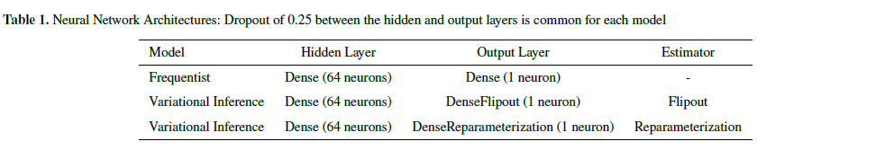
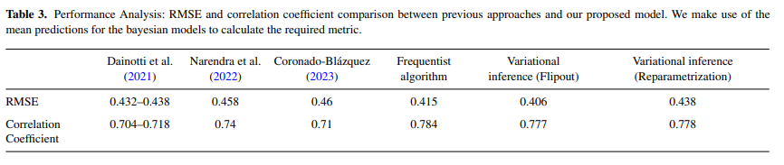
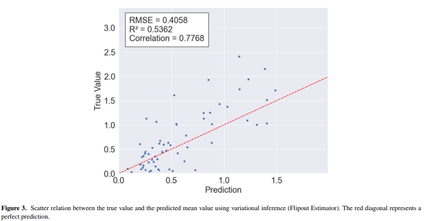
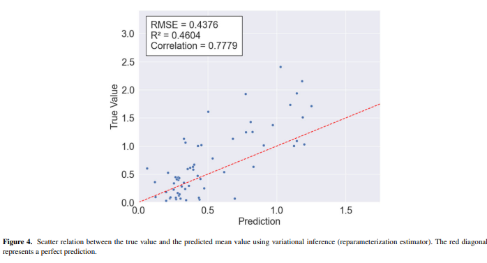
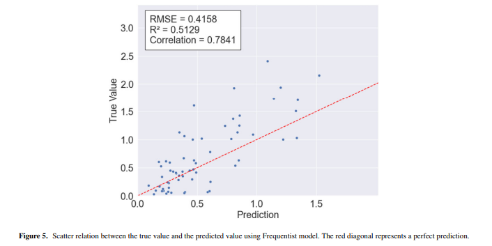
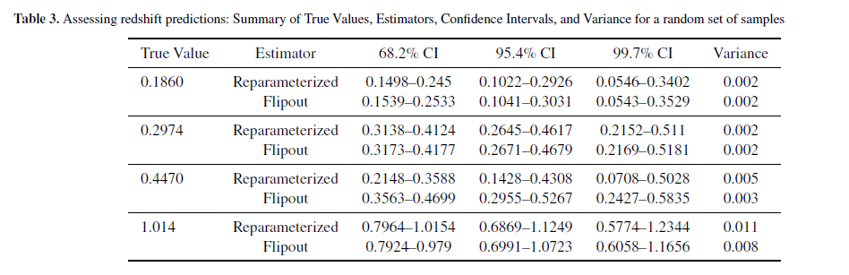
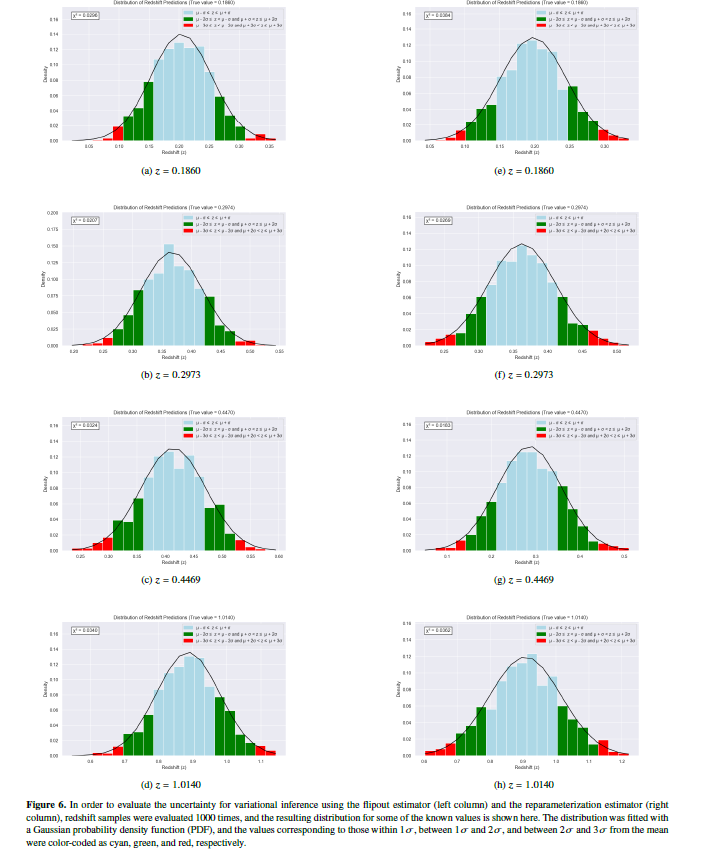
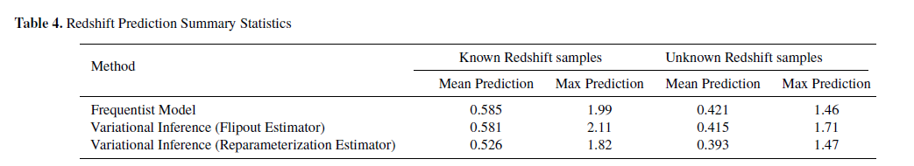
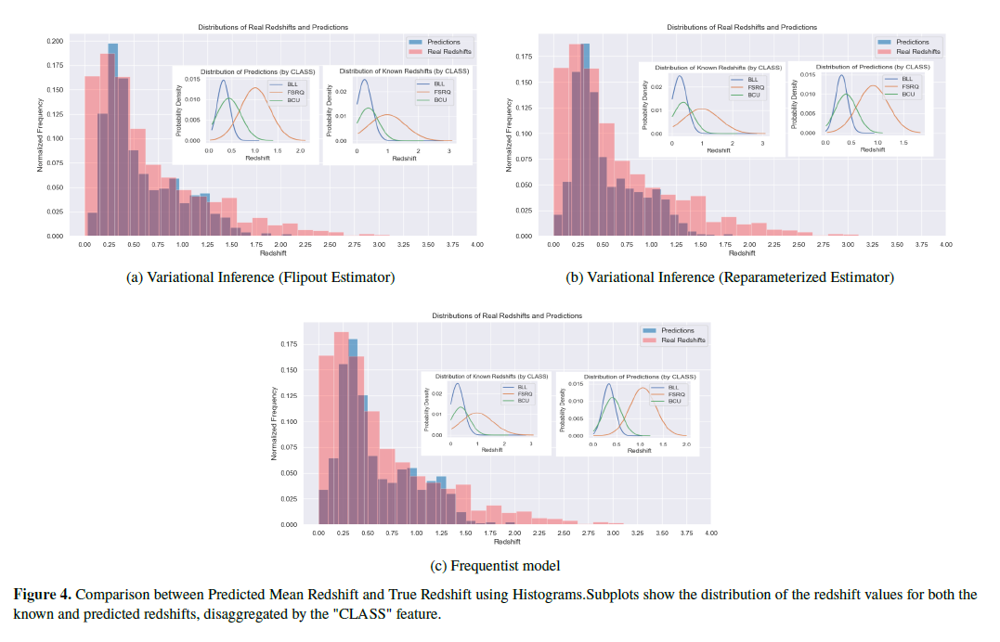
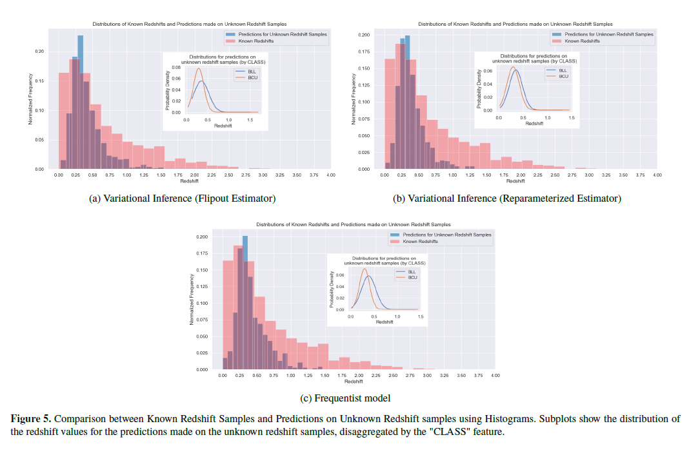

# Estimating the redshift and associated uncertainty of Fermi-LAT extra galactic sources

## Models used

## Results in comparison to other algorithms

## Sample predictions

## Prediction summary

